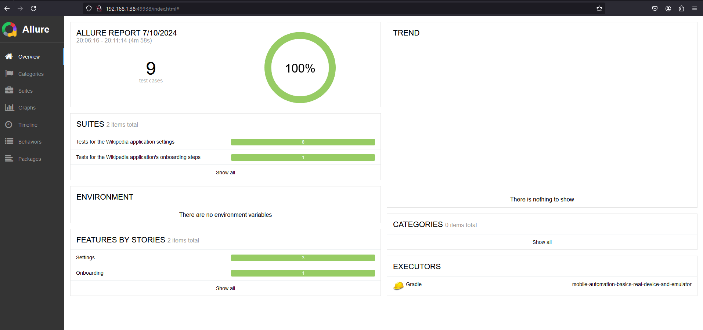
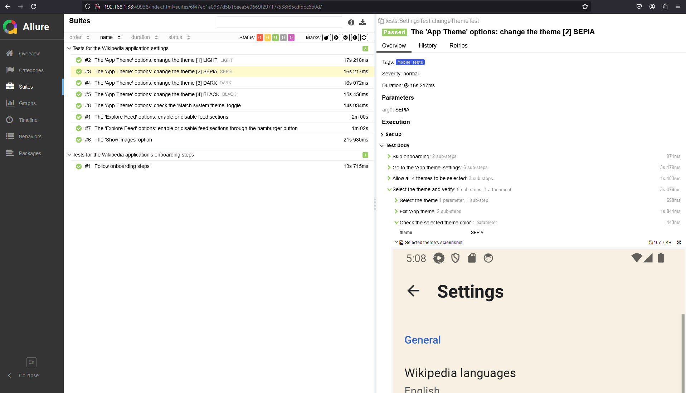
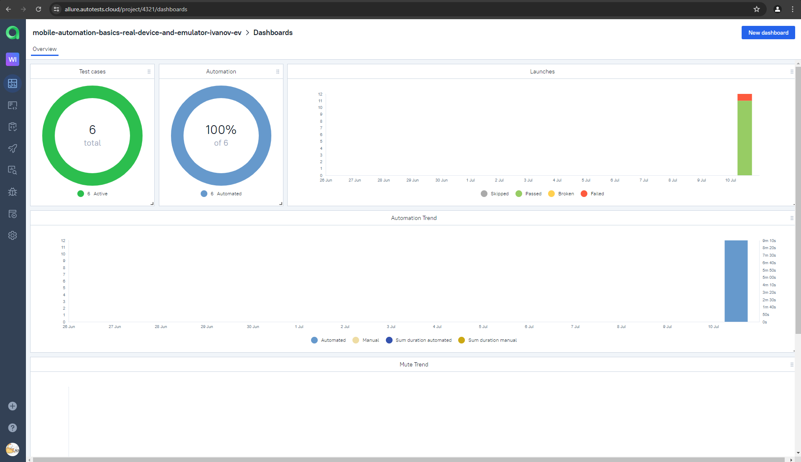
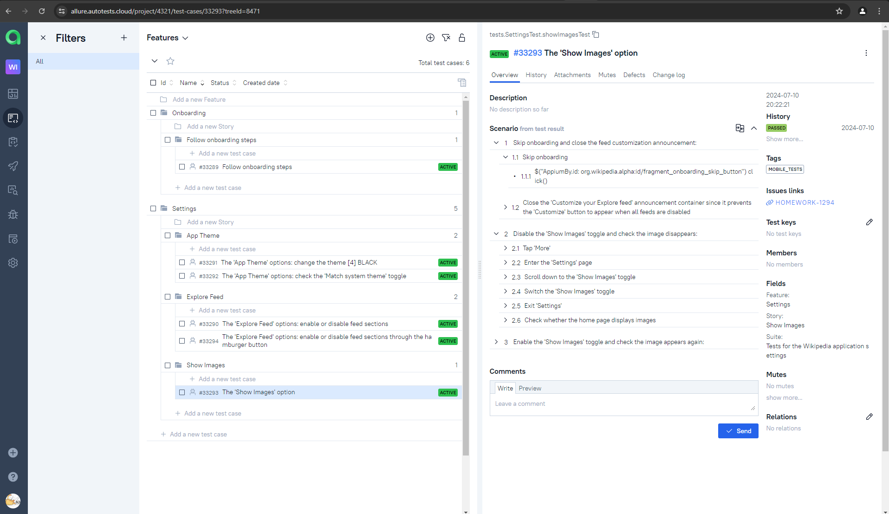
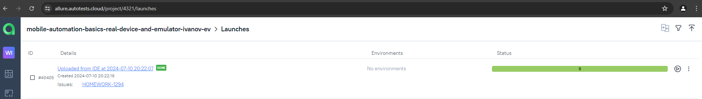
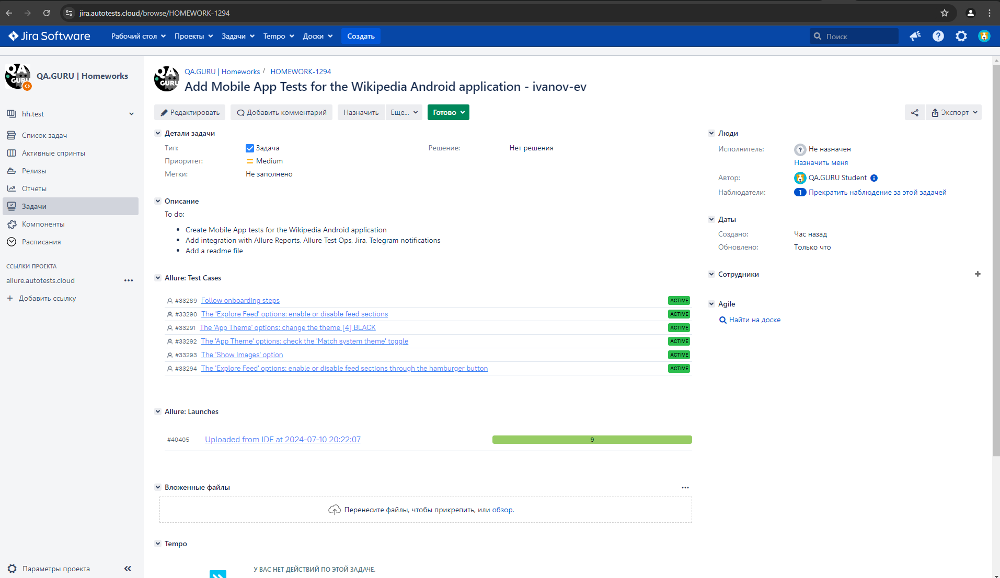
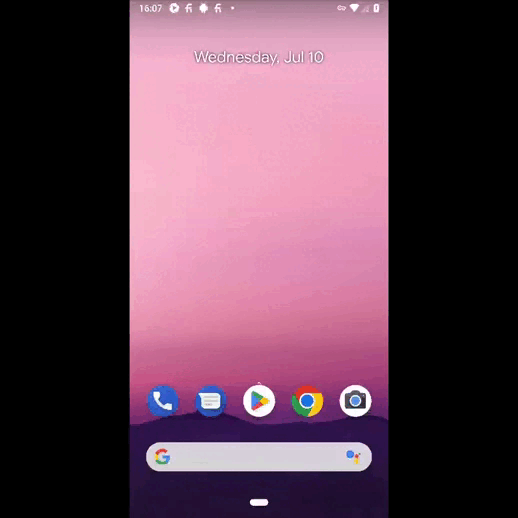

# Sample Test Automation Project for the 'Wikipedia' application (on real Android devices / Android Emulator / Browserstack)

---
The Wikipedia application for Android can be found <a href="https://github.com/wikimedia/apps-android-wikipedia">here</a>.

<a href="https://github.com/wikimedia/apps-android-wikipedia"></a>

> [!NOTE]
> This is my final project for the 'Java Test Automation' course at <a href="https://qa.guru">QA.GURU</a>.
> The project is provided as a demonstration of my skills in Mobile App tests.
> Keeping the project up to date is not guaranteed.
>
> Access to Jira, Jenkins, and AllureTestOps is managed by the <a href="https://qa.guru">QA.GURU</a> administration.

---

## Contents:

- <a href="#tools">Tools and Technologies</a>
- <a href="#scenarios">Test Scenarios</a>
- <a href="#cli">Launch from the CLI</a>
- <a href="#allure">Allure Reports</a>
- <a href="#allure-testops">Integration with Allure TestOps</a>
- <a href="#jira">Integration with JIRA</a>

---

<a id="tools"></a>
## Tools and Technologies:

| Java                                                                                                        | IntelliJ  <br>  Idea                                                                                                  | GitHub                                                                                                        | JUnit 5                                                                                                              | Gradle                                                                                                        | Allure <br> Report                                                                                                                    | Jira                                                                                                                              | Allure <br> TestOps                                                                                                     |
|-------------------------------------------------------------------------------------------------------------|-----------------------------------------------------------------------------------------------------------------------|---------------------------------------------------------------------------------------------------------------|----------------------------------------------------------------------------------------------------------------------|---------------------------------------------------------------------------------------------------------------|---------------------------------------------------------------------------------------------------------------------------------------|-----------------------------------------------------------------------------------------------------------------------------------|-------------------------------------------------------------------------------------------------------------------------|
| <a href="https://www.java.com/"></a> | <a href="https://www.jetbrains.com/idea/"></a> | <a href="https://github.com/"></a> | <a href="https://junit.org/junit5/"></a> | <a href="https://gradle.org/"></a> | <a href="https://github.com/allure-framework/allure2"></a> | <a href="https://www.atlassian.com/ru/software/jira/"></a> | <a href="https://qameta.io/"></a> |

---

<a id="scenarios"></a>
## Test Scenarios

Mobile App tests for the Wikipedia application (Android):

The onboarding page tests:
* [x]  Follow onboarding steps (Automated)

The setting page tests:
* [x] The 'Explore Feed' options: enable or disable feed sections (Automated)
* [x] The 'Explore Feed' options: enable or disable feed sections through the hamburger button (Automated)
* [x] The 'Show Images' option (Automated)
* [x] The 'App Theme' options: change the theme (Automated, Parameterized)
* [x] The 'App Theme' options: check the 'Match system theme' toggle (Automated, only for the emulator)

---

<a id="cli"></a>
## Launch from the CLI

The commands to run tests for the Wikipedia application from the IDEA terminal:

- the Android emulator:

```shell
gradle clean test -DdeviceHost=emulator
```

- real Android devices:

```shell
gradle clean test -DdeviceHost=real
```

- `Browserstack`:

```shell
gradle clean test -DdeviceHost=browserstack
```

---

<a id="allure"></a>
## </a>Allure Reports

`Allure report` contains test steps.

 



---


<a id="allure-testops"></a>
## </a> Integration with <a target="_blank" href="https://allure.autotests.cloud/project/4321/dashboards">Allure TestOps</a>

Test cases and test execution history are available in `Allure TestOps`.

The dashboard displays test run statistics:



Automated test cases:



Launches:



---

<a id="jira"></a>
## </a> Integration with <a target="_blank" href="https://jira.autotests.cloud/browse/HOMEWORK-1294">Jira</a>

There is a task in `Jira` that contains references to Allure test cases and Allure launches:



---

<a id="testexecution"></a>
## Test Execution Example




